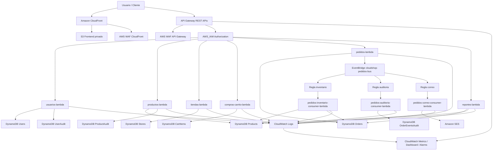

# Arquitectura de CloudShop Enterprise

## High-level Architecture

CloudShop Enterprise usa una arquitectura serverless modular en AWS. La capa de entrada se divide en:

- Frontend estatico servido desde CloudFront.
- APIs REST independientes por modulo mediante Amazon API Gateway.

La capa de computo esta implementada con AWS Lambda. La persistencia transaccional y de consulta se realiza en Amazon DynamoDB. El flujo de pedidos usa Amazon EventBridge para desacoplar efectos secundarios como inventario, auditoria y correo.

## Service Interaction

El comportamiento general es:

1. El usuario accede al frontend por CloudFront.
2. CloudFront obtiene archivos estaticos desde S3 usando Origin Access Control.
3. El frontend consume las APIs REST configuradas en `config.js`.
4. API Gateway valida autorizacion `AWS_IAM`.
5. API Gateway invoca la Lambda del modulo correspondiente.
6. La Lambda accede a DynamoDB con permisos minimos.
7. Las Lambdas escriben logs estructurados en CloudWatch Logs.
8. CloudWatch Dashboard y Alarms consolidan el estado operacional.

## Event-driven Architecture

El modulo `Pedidos` es el nucleo orientado a eventos.

Flujo al crear un pedido:

1. `POST /pedidos` invoca `pedidos-lambda`.
2. `pedidos-lambda` persiste el pedido en `Orders`.
3. `pedidos-lambda` publica `PedidoCreado` en `cloudshop-pedidos-bus`.
4. EventBridge evalua reglas independientes.
5. `pedidos-inventario-consumer-lambda` descuenta inventario en `Products`.
6. `pedidos-auditoria-consumer-lambda` almacena el evento completo en `OrderEventsAudit`.
7. `pedidos-correo-consumer-lambda` envia una notificacion por Amazon SES cuando el evento incluye `customerEmail`.

Las consumidoras estan desacopladas: ninguna Lambda consumidora invoca a otra.

## Infrastructure Diagram

## Module Relationships

| Modulo | Depende de | Expone | Datos administrados |
| --- | --- | --- | --- |
| Usuarios | Ningun modulo funcional | API de usuarios | `Users`, `UserAudit` |
| Productos | Ningun modulo funcional | API de productos e inventario | `Products`, `ProductAudit` |
| Tiendas | Ningun modulo funcional | API de tiendas | `Stores` |
| Compras | Ningun modulo funcional | API de carritos | `CartItems` |
| Pedidos | `Products` para inventario | API de pedidos, EventBridge bus | `Orders`, `OrderEventsAudit` |
| Reportes | `Orders`, `Products` existentes | API de reportes | No duplica datos |
| Frontend | Outputs de APIs | CloudFront URL | Objetos S3 del sitio |
| Seguridad | Stage ARNs de APIs y Web ACL ARN de CloudFront | WAF | No administra datos de negocio |
| Observabilidad | Nombres de Lambdas, APIs y tablas | Dashboard y alarmas | No administra datos de negocio |

El modulo raiz conecta outputs entre modulos cuando es necesario. Los modulos funcionales conservan su independencia y su propia infraestructura.
