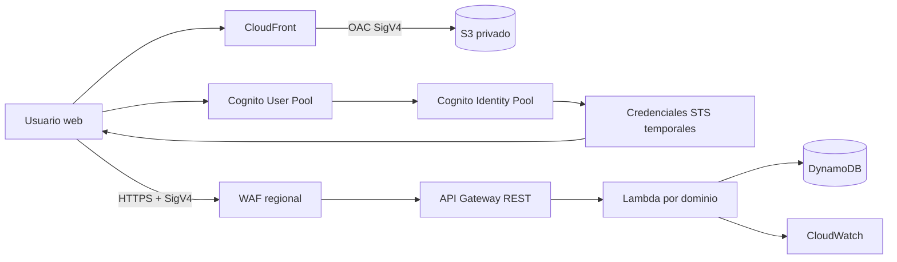
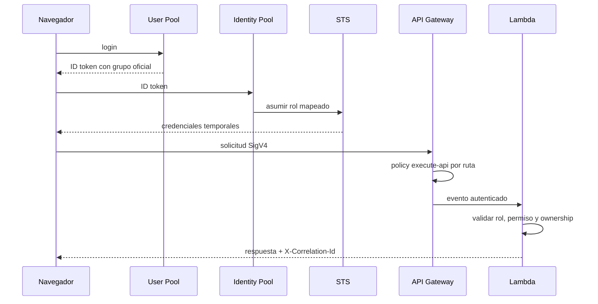
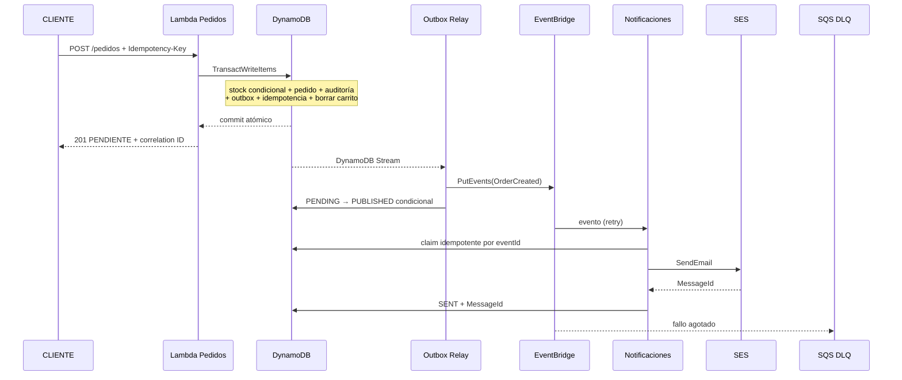

# Arquitectura de CloudShop Enterprise

## Vista de contexto

CloudFront no encadena S3, WAF y API Gateway. S3 es su origen privado. El Web ACL
regional se asocia directamente al ARN del stage de API Gateway; por tanto protege
las APIs, mientras CloudFront y OAC protegen la publicación estática.

## Componentes

| Componente | Responsabilidad | Control principal |
|---|---|---|
| S3 frontend | Build Vite versionado | Sin acceso público, SSE-S3 |
| CloudFront | TLS, caché, SPA routing | OAC, headers CSP/HSTS |
| Cognito User Pool | Registro, login, grupos | Password policy; cliente sin secret |
| Cognito Identity Pool | Selección de rol y STS | Solo autenticados, resolución ambigua `Deny` |
| WAF regional | Rate limit y reglas administradas | Asociado a API Gateway |
| API Gateway REST | Contrato y autorización de ruta | `AWS_IAM`, throttling, métricas |
| Lambda | Dominio, rol, permiso y ownership | IAM mínimo, logs estructurados |
| DynamoDB | Estado transaccional | Cifrado, PITR, condiciones |
| EventBridge/SQS | Eventos, retry y DLQ | Evento versionado e idempotencia |
| SES | Notificación de pedido | Identidad verificada y config set |
| CloudWatch | Logs, filtros, métricas y alarmas | Retención 30 días por defecto |

## Flujo de identidad y autorización

La UI oculta rutas ajenas, pero no se considera un control de seguridad. IAM limita la
ruta y la Lambda vuelve a validar reglas de dominio/propiedad.

## Flujo confiable de pedido

No existe una falsa barrera de fan-out. Pedido, stock, auditoría y outbox son atómicos;
correo es posterior, al-menos-una-vez y tolerante a duplicados. Un fallo después de
SES y antes de guardar `MessageId` puede duplicar correo, limitación documentada.

## Consistencia y fallos

- Stock nunca baja de cero por condición `inventory >= quantity` dentro de la
  transacción.
- La versión del carrito evita checkout sobre contenido modificado.
- El token transaccional se deriva de operación + idempotency key para evitar colisión
  entre checkout, cambio de estado y cancelación.
- Cancelar repone inventario una sola vez con `inventoryRestored`.
- El relay puede publicar duplicado si falla después de `PutEvents`; el consumidor usa
  `eventId`.
- EventBridge reintenta y deriva fallos agotados a SQS.
- Correlation ID se persiste en pedido, auditoría, outbox, evento y logs.

## Asociaciones AWS válidas

- `CloudFront origin_access_control_id → S3 bucket policy` con condición
  `AWS:SourceArn` de la distribución.
- `aws_wafv2_web_acl_association → aws_api_gateway_stage.arn`, scope `REGIONAL`.
- User Pool groups → IAM role ARNs → Identity Pool roles attachment.
- DynamoDB Stream Outbox → Lambda Relay → EventBridge rule → Lambda Notificaciones.
- EventBridge target → SQS DLQ mediante resource policy.

## Decisiones y límites

- ADR-001 selecciona Cognito User Pool + Identity Pool + SigV4.
- Reportes académicos usan `Scan` paginado; producción de gran escala necesitaría
  agregados materializados.
- El despliegue actual está BLOCKED; esta arquitectura está validada estáticamente,
  no observada en AWS.
